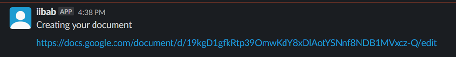
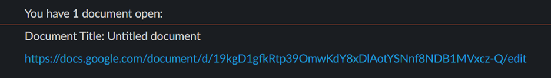
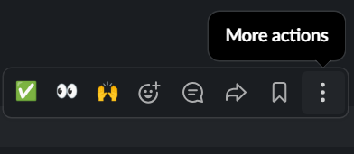
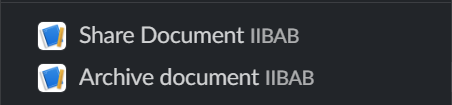
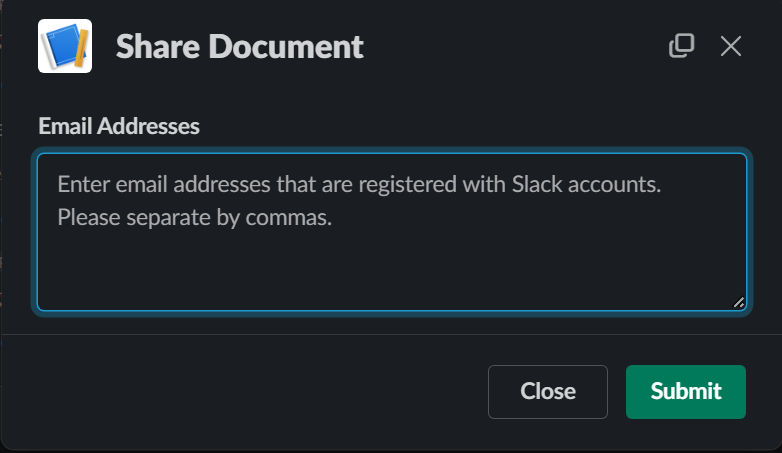
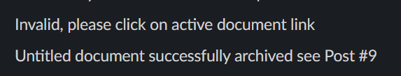
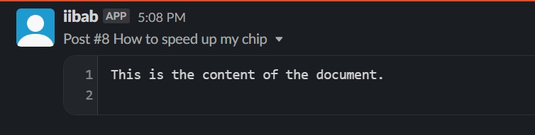

# iibab (If it has been asked before) 
iibab is a Python Slack bot is designed to streamline the process of managing Google Documents directly from Slack. It allows users to create, share, archive, and delete Google Docs, as well as to keep track of document-related activities using a SQLite database.
# Key Functionalities  
**Document Creation:** Users can create new Google Docs via Slack commands. The bot then shares a link to the newly created document with the user.

**Document Sharing:** The bot enables sharing of documents with specified email addresses, making collaboration easy and efficient.

**Document Archiving:** This feature converts Google Docs into Markdown format and archives them in a designated Slack channel, thereby preserving important information in an accessible format.

**Document Management:** Users can list, share, and delete documents directly from Slack. This feature is particularly useful for maintaining a clean and organized document repository.

**Database Tracking:** The bot employs a SQLite database to track document interactions. This database logs details such as document creation, sharing, and archiving activities, offering valuable insights into document usage and management.

# How to use project 

**Creating a document**  

To create a Google Docs file, type “@iibab” in any channel.  

The bot will create a Google Docs file and send a direct message with the document link.  

To access direct messages with iibab, click on iibab in the apps section in the left side of your screen and then click messages.  

You can click on this link to access the file.  

Users will create a document when they have information worth sharing and documenting relating to the workspace or class. This could be an ongoing issue, how to resolve an issue or instructions on how to start a specific task. 

**Listing active files** 

To list your active files, type /list_files into any channel or direct message.  

iibab will send you a direct message listing all the active files you have created or others have shared with you.  

This is used to keep track of what documents you are working on and if you need the link for accessing, archiving, or sharing the document.  

**Sharing a document** 

To share a document, hover over a Google Docs link provided by the bot, click the three vertical dots which says more actions.

Click “Share Document iibab”.

Enter the email addresses for the users you want to share the document with.

Make sure the email addresses are associated with the users’ Slack accounts.

Click submit, if successful you will get a message “Successfully shared document with provided emails”.

The users who you shared with will also get a message “A document has been shared with you” and an updated list of active files of the user will be sent to them. 

If the emails provided are invalid, e.g., they are not associated with Slack user IDs or they are misspelled, you will get a message “The following emails are invalid” and it will list the invalid emails. 

 

**Archiving a document** 
To archive a document hover over a Google Docs link provided by the bot, click the three vertical dots which says more actions.

Click “Archive Document iibab”.

The document will be saved to where your directory is specified, posted into an FAQ read only channel, and then deleted.

The document will no longer appear in the list of active files, as it is no longer active.

If successful, you will get a message “[Document title] successfully archived see post #X.

If “Archive Document” is clicked on an inactive link or a message without a link, you will receive the message “Invalid, please click on active document link”.

Users will archive a document when they are finished with an issue or instruction and want to share it with their classmates or coworkers.

Everyone can then access the specified FAQ channel to look for solutions to issues or instructions for specific tasks all within Slack. 

 

# License 
[MIT](https://choosealicense.com/licenses/mit/)
